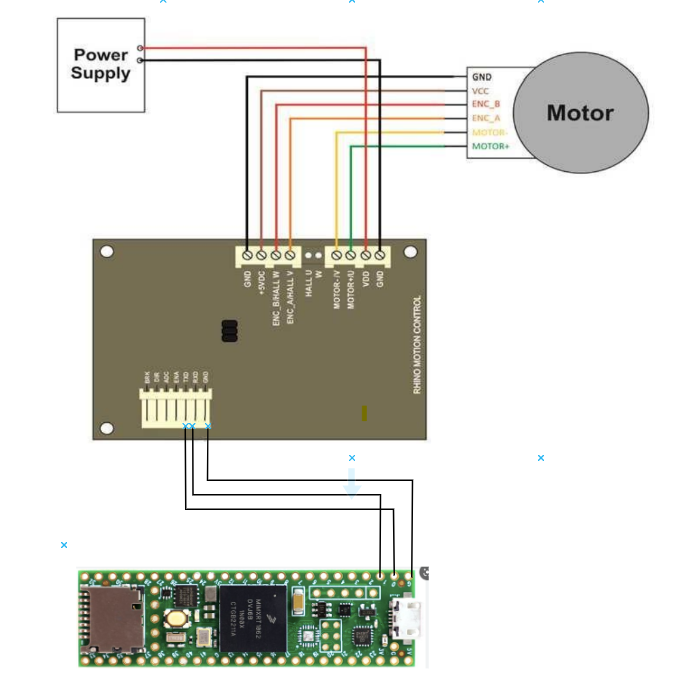
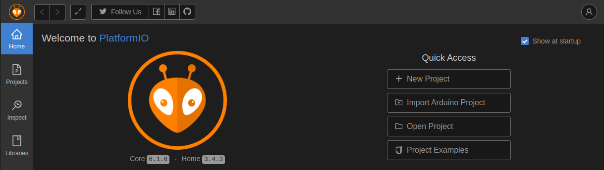
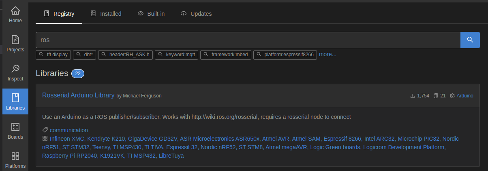

# **Rhino DC Motor Position Control with RMCS 2303**
## **Introduction:**
The repository consist of steps and guide for controlling a Rhino DC Motor with RMCS 2303 Driver based on ROS topics. 

&nbsp;
## **Components Needed**:
- Rhino DC Motor - 1
- RMCS 2303 Driver -1
- 12 V DC Power supply
- BreadBoard
- Jumper Wires
- Teensy 4.1

&nbsp;

## **Pre-Requisite:**
- ROS Noetic
- VS Code with PlatformIO 

&nbsp;
&nbsp;

## **Circuit Diagram & Connections**
- TX -> RX (Pin 0)
- RX -> TX (Pin 1)
- GND -> GND
- Configure slave id on Motor Driver. Follow the tutorial https://www.manualslib.com/manual/2141104/Rhino-Rmcs-2303.html?page=7


- 

&nbsp;
## **Procedure**:

1. Create New Project 
&nbsp;
2. Name the project, Select Board teensey 4.1


3. Create src/main.cpp, paste the code present in src folder. Change the CPR Value for adjusting the angle rotation of motor.
&nbsp;
&nbsp;

4. Go to Include folder and make a file named RMCS2303.h and paste the given code:


&nbsp;

5. Go to src folder and create a file named RMCS2303.cpp and paste the given code:


6. Go to libraries section and search for ros. Download the Rosserial Arduino Library by Michael Ferguson. Select the project name and add project dependency. 
&nbsp;
7. Compile the Code and upload to teensey.
8. Run the below commands in separate terminals:-

9. Terminal 1: 
```
roscore
```

10. Terminal 2: 

```
rosrun rosserial_arduino serial_node.py /dev/ttyACM0 _baud:=9600
```
11. Terminal 3: 
```
*rostopic pub /position_in std_msgs/Float32 "data: 10.0" -1*
```
